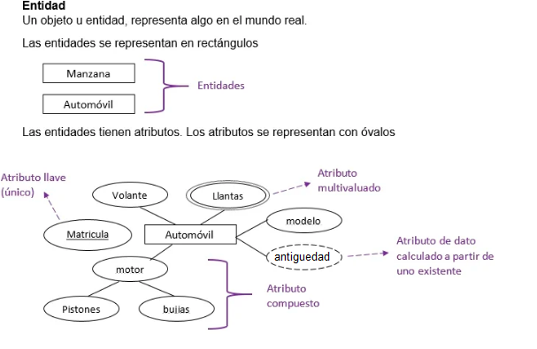
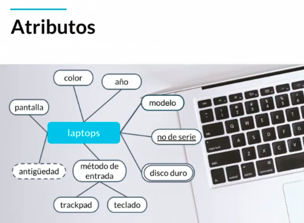

# Fundamentos-bases-datos

### Indice
- [Fundamentos de Bases de Datos](#fundamentos-de-bases-de-datos)
    - [conceptos básicos](#conceptos-basicos)
        - [Tipos de bases de datos](#tipos-de-bases-de-datos)
        - [Servicios](#servicios)
  - [Introducción a las bases de datos relacionales](#introducción-a-las-bases-de-datos-relacionales)
    - [Entidades y atributos](#entidades-y-atributos)
      - [Atributos](#atributos)
      - [Entidades](#entidades)
      - [Entidades de Platzi Blog](#entidades-de-platzi-blog)
    - [Relaciones](#relaciones)
      - [Cardinalidad: 1 a 1](#cardinalidad-1-a-1)
      - [Cardinalidad: 0 a 1](#cardinalidad-0-a-1)
      - [Cardinalidad: 1 a N (1 a muchos)](#cardinalidad-1-a-n-1-a-muchos)
      - [Cardinalidad: 0 a N](#cardinalidad-0-a-n)
    - [ Multiples muchos](#clase-7-multiples-muchos)
    - [Diagrama ER](#clase-8-diagrama-er)
    - [ Diagrama Físico: tipos de datos y constraints](#clase-9-diagrama-físico-tipos-de-datos-y-constraints)
      - [Tipos de dato](#tipos-de-dato)
      - [Constraints (Restricciones)](#constraints-restricciones)
    - [Diagrama Físico: normalizacion](#clase-10-diagrama-físico-normalizacion)
    - [ Diagrama Físico: normalizando Platziblog](#clase-11-diagrama-físico-normalizando-platziblog)
      - [Diagram Entidad Relacion](#diagram-entidad-relacion)
      - [Diagrama fisico Paso 1](#diagrama-fisico-paso-1)
      - [Diagrama fisico Paso 2](#diagrama-fisico-paso-2)
      - [Diagrama fisico Paso 3](#diagrama-fisico-paso-3)
    - [ Formas normales en DB relacionales](#clase-12-formas-normales-en-db-relacionales)
      - [Primera Forma Normal (1FN)](#primera-forma-normal-1fn)
      - [Segunda Forma Normal (2FN)](#segunda-forma-normal-2fn)
      - [Tercera Forma Normal (3FN)](#tercera-forma-normal-3fn)
      - [Cuarta Forma Normal (4FN)](#cuarta-forma-normal-4fn)
  - [Modulo 3 RDBMS (MySQL) o cómo hacer lo anterior de manera práctica](#modulo-3-rdbms-mysql-o-cómo-hacer-lo-anterior-de-manera-práctica)
    - [ RDB Qué](#clase-13-rdb-qué)
    - [ Instalación local de un RDBMS (Windows)](#clase-14-instalación-local-de-un-rdbms-windows)
    - [ Instalación local de un RDBMS (Mac)](#clase-15-instalación-local-de-un-rdbms-mac)
    - [ Instalación local de un RDBMS (Ubuntu)](#clase-16-instalación-local-de-un-rdbms-ubuntu)
    - [Clientes Graficos](#clase-17-clientes-graficos)
    - [Servicios administrados](#clase-18-servicios-administrados)
  - [Modulo 4 SQL hasta en la sopa](#modulo-4-sql-hasta-en-la-sopa)
    - [ Historia de SQL](#clase-19-historia-de-sql)
    - [ DDL create](#clase-20-ddl-create)
    - [ CREATE VIEW y DDL ALTER](#clase-21-create-view-y-ddl-alter)
      - [Create view](#create-view)
      - [Alter Table](#alter-table)
      - [Drop Column Borrando una columna](#drop-column-borrando-una-columna)
    - [ DDL drop](#clase-22-ddl-drop)
    - [ DML](#clase-23-dml)
      - [Insert](#insert)
      - [Update](#update)
      - [Delete](#delete)
      - [Select](#select)
    - [ Que tan standard es SQL](#clase-24-que-tan-standard-es-sql)
    - [Creando Platziblog: tablas independientes](#clase-25-creando-platziblog-tablas-independientes)
    - [Creando Platziblog: tablas transitivas](#clase-26-creando-platziblog-tablas-transitivas)
    - [ Creando Platziblog: tablas transitivas](#clase-27-creando-platziblog-tablas-transitivas)
      - [Reverse Engineer](#reverse-engineer)
    - [ Por qué las consultas son tan importantes](#clase-28-por-qué-las-consultas-son-tan-importantes)
    - [ Estructura básica de un Query](#clase-29-estructura-básica-de-un-query)
      - [Primer Consulta](#primer-consulta)
    - [ SELECT](#clase-30-select)
    - [ FROM](#clase-31-from)
    - [ Utilizando la sentencia FROM](#clase-32-utilizando-la-sentencia-from)
    - [ WHERE](#clase-33-where)
    - [ Utilizando la sentencia WHERE nulo y no nulo](#clase-34-utilizando-la-sentencia-where-nulo-y-no-nulo)
    - [ GROUP BY](#clase-35-group-by)
    - [ORDER BY y HAVING](#clase-36-order-by-y-having)
    - [ El interminable agujero de conejo (Nested queries)](#clase-37-el-interminable-agujero-de-conejo-nested-queries)
    - [ Como convertir una pregunta en un query SQL](#clase-38-como-convertir-una-pregunta-en-un-query-sql)
      - [De pregunta a Query](#de-pregunta-a-query)
    - [ Preguntandole a la base de datos](#clase-39-preguntandole-a-la-base-de-datos)
    - [ Consultando PlatziBlog](#clase-40-consultando-platziblog)
  - [Modulo 4 Introduccion a la bases de datos NO relacionales](#modulo-4-introduccion-a-la-bases-de-datos-no-relacionales)
    - [ Que son y cuales son los tipos de bases de datos no relacionales](#clase-41-que-son-y-cuales-son-los-tipos-de-bases-de-datos-no-relacionales)
      - [Tipos de bases de datos no relacionales:](#tipos-de-bases-de-datos-no-relacionales)
    - [ Servicios administrados y jerarquía de datos](#clase-42-servicios-administrados-y-jerarquía-de-datos)
  - [Modulo 5 Manejo de modelos de datos en bases de datos no relacionales](#modulo-5-manejo-de-modelos-de-datos-en-bases-de-datos-no-relacionales)
    - [ Top level collection con Firebase](#clase-43-top-level-collection-con-firebase)
    - [Creando y borrando documentos en Firestore](#clase-44-creando-y-borrando-documentos-en-firestore)
    - [ Colecciones vs subcolecciones](#clase-45-colecciones-vs-subcolecciones)
    - [ Recreando Platziblog](#clase-46-recreando-platziblog)
    - [ Construyendo Platziblog en Firestore](#clase-47-construyendo-platziblog-en-firestore)
    - [ Proyecto final: transformando tu proyecto en una db no relacional](#clase-48-proyecto-final-transformando-tu-proyecto-en-una-db-no-relacional)
      - [Regla 1. Piensa en la vista de tu aplicación](#regla-1-piensa-en-la-vista-de-tu-aplicación)
  - [Modulo 6 Bases de datos en la vida real](#modulo-6-bases-de-datos-en-la-vida-real)
    - [Bases de datos en la vida real](#clase-49-bases-de-datos-en-la-vida-real)
    - [ Big Data](#clase-50-big-data)
    - [ Data warehouse](#clase-51-data-warehouse)
    - [ Data mining](#clase-52-data-mining)
    - [ ETL](#clase-53-etl)
    - [ Business intelligence](#clase-54-business-intelligence)
    - [ Machine Learning](#clase-55-machine-learning)
    - [ Data Science](#clase-56-data-science)
    - [ Por que aprender bases de datos hoy](#clase-57-por-que-aprender-bases-de-datos-hoy)
  - [Bonus](#bonus)
    - [Bases de datos relacionales vs no relacionales](#clase-58-bases-de-datos-relacionales-vs-no-relacionales)

# Bases de datos relacionales

<p align="left">
  <a href="https://www.microsoft.com/es-es/sql-server/sql-server-downloads" target="_blank">
    
  </a>
  <a href="https://www.postgresql.org/" target="_blank">
    
  </a>
  <a href="https://www.oracle.com/co/index.html" target="_blank">
    
  </a>
  <a href="https://www.mysql.com/" target="_blank">
    
  </a>
</p>

### Tipos de bases de datos

#### Relacionales: 
Una base de datos relacional es una recopilación de elementos de datos con relaciones predefinidas entre ellos. Estos elementos se organizan como un conjunto de tablas con columnas y filas. Las tablas se utilizan para guardar información sobre los objetos que se van a representar en la base de datos. Cada columna de una tabla guarda un determinado tipo de datos y un campo almacena el valor real de un atributo. Las filas de la tabla representan una recopilación de valores relacionados de un objeto o una entidad. Cada fila de una tabla podría marcarse con un identificador único denominado clave principal, mientras que filas de varias tablas pueden relacionarse con claves extranjeras. Se puede obtener acceso a estos datos de muchas formas distintas sin reorganizar las propias tablas de la base de datos.

#### No relacionales: 
Las bases de datos no relacionales son un sistema de almacenamiento de información que se caracteriza por no usar el lenguaje SQL para las consultas. Esto no significa que no puedan usar el lenguaje SQL, pero no lo hacen como herramienta de consulta, sino como apoyo. Por ello también se les suele llamar NoSQL o «no solo SQL».

### Servicios

**Auto administrados:** Es la base de datos que instalas tú y te encargas de actualizaciones, mantenimiento, etc.
**Administrados:** Servicios que ofrecen las nubes modernas como Azure y no debes preocuparte por mantenimiento o actualizaciones.

### Entidad

Una **entidad**  representa algo en el mundo real, incluso algo abstracto. Tienen atributos que son las cosas que los hacen ser una entidad, se diagraman dentro de cuadrados  y **por convención se ponen en plural**.

Nota: Por convección las entidades se ponen en plural por ejemplo laptos

### Atributos

Las entidades tienen atributos que son las cosas que lo hacen ser una entidad.

Los **atributos compuestos** son aquellos que tienen atributos ellos mismos.

Los **atributos llave** son aquellos que identifican a la entidad y no pueden ser repetidos, se diagraman con underline. Existen:

- Naturales: Son inherentes al objeto como el número de serie
- Clave artificial: No es inherente al objeto y se asigna de manera arbitraria



### Ejemplo con laptos


**Table of Contents**

[TOCM]

[TOC]

#H1 header
##H2 header
###H3 header
####H4 header
#####H5 header
######H6 header
#Heading 1 link [Heading link](https://github.com/pandao/editor.md "Heading link")
##Heading 2 link [Heading link](https://github.com/pandao/editor.md "Heading link")
###Heading 3 link [Heading link](https://github.com/pandao/editor.md "Heading link")
####Heading 4 link [Heading link](https://github.com/pandao/editor.md "Heading link") Heading link [Heading link](https://github.com/pandao/editor.md "Heading link")
#####Heading 5 link [Heading link](https://github.com/pandao/editor.md "Heading link")
######Heading 6 link [Heading link](https://github.com/pandao/editor.md "Heading link")

##Headers (Underline)

H1 Header (Underline)
=============

H2 Header (Underline)
-------------

###Characters
                
----

~~Strikethrough~~ <s>Strikethrough (when enable html tag decode.)</s>
*Italic*      _Italic_
**Emphasis**  __Emphasis__
***Emphasis Italic*** ___Emphasis Italic___

Superscript: X<sub>2</sub>，Subscript: O<sup>2</sup>

**Abbreviation(link HTML abbr tag)**

The <abbr title="Hyper Text Markup Language">HTML</abbr> specification is maintained by the <abbr title="World Wide Web Consortium">W3C</abbr>.

###Blockquotes

> Blockquotes

Paragraphs and Line Breaks
                    
> "Blockquotes Blockquotes", [Link](http://localhost/)。

###Links

[Links](http://localhost/)

[Links with title](http://localhost/ "link title")

`<link>` : <https://github.com>

[Reference link][id/name] 

[id/name]: http://link-url/

GFM a-tail link @pandao

###Code Blocks (multi-language) & highlighting

####Inline code

`$ npm install marked`

####Code Blocks (Indented style)

Indented 4 spaces, like `<pre>` (Preformatted Text).

    <?php
        echo "Hello world!";
    ?>
    
Code Blocks (Preformatted text):

    | First Header  | Second Header |
    | ------------- | ------------- |
    | Content Cell  | Content Cell  |
    | Content Cell  | Content Cell  |

####Javascript　

```javascript
function test(){
	console.log("Hello world!");
}
 
(function(){
    var box = function(){
        return box.fn.init();
    };

    box.prototype = box.fn = {
        init : function(){
            console.log('box.init()');

			return this;
        },

		add : function(str){
			alert("add", str);

			return this;
		},

		remove : function(str){
			alert("remove", str);

			return this;
		}
    };
    
    box.fn.init.prototype = box.fn;
    
    window.box =box;
})();

var testBox = box();
testBox.add("jQuery").remove("jQuery");
```

####HTML code

```html
<!DOCTYPE html>
<html>
    <head>
        <mate charest="utf-8" />
        <title>Hello world!</title>
    </head>
    <body>
        <h1>Hello world!</h1>
    </body>
</html>
```

###Images

Image:


> Follow your heart.


> 图为：厦门白城沙滩 Xiamen

图片加链接 (Image + Link)：

[](https://pandao.github.io/editor.md/examples/images/7.jpg "李健首张专辑《似水流年》封面")

> 图为：李健首张专辑《似水流年》封面
                
----

###Lists

####Unordered list (-)

- Item A
- Item B
- Item C
     
####Unordered list (*)

* Item A
* Item B
* Item C

####Unordered list (plus sign and nested)
                
+ Item A
+ Item B
    + Item B 1
    + Item B 2
    + Item B 3
+ Item C
    * Item C 1
    * Item C 2
    * Item C 3

####Ordered list
                
1. Item A
2. Item B
3. Item C
                
----
                    
###Tables
                    
First Header  | Second Header
------------- | -------------
Content Cell  | Content Cell
Content Cell  | Content Cell 

| First Header  | Second Header |
| ------------- | ------------- |
| Content Cell  | Content Cell  |
| Content Cell  | Content Cell  |

| Function name | Description                    |
| ------------- | ------------------------------ |
| `help()`      | Display the help window.       |
| `destroy()`   | **Destroy your computer!**     |

| Item      | Value |
| --------- | -----:|
| Computer  | $1600 |
| Phone     |   $12 |
| Pipe      |    $1 |

| Left-Aligned  | Center Aligned  | Right Aligned |
| :------------ |:---------------:| -----:|
| col 3 is      | some wordy text | $1600 |
| col 2 is      | centered        |   $12 |
| zebra stripes | are neat        |    $1 |
                
----

####HTML entities

&copy; &  &uml; &trade; &iexcl; &pound;
&amp; &lt; &gt; &yen; &euro; &reg; &plusmn; &para; &sect; &brvbar; &macr; &laquo; &middot; 

X&sup2; Y&sup3; &frac34; &frac14;  &times;  &divide;   &raquo;

18&ordm;C  &quot;  &apos;

##Escaping for Special Characters

\*literal asterisks\*

##Markdown extras

###GFM task list

- [x] GFM task list 1
- [x] GFM task list 2
- [ ] GFM task list 3
    - [ ] GFM task list 3-1
    - [ ] GFM task list 3-2
    - [ ] GFM task list 3-3
- [ ] GFM task list 4
    - [ ] GFM task list 4-1
    - [ ] GFM task list 4-2

###Emoji mixed :smiley:

> Blockquotes :star:

####GFM task lists & Emoji & fontAwesome icon emoji & editormd logo emoji :editormd-logo-5x:

- [x] :smiley: @mentions, :smiley: #refs, [links](), **formatting**, and <del>tags</del> supported :editormd-logo:;
- [x] list syntax required (any unordered or ordered list supported) :editormd-logo-3x:;
- [x] [ ] :smiley: this is a complete item :smiley:;
- [ ] []this is an incomplete item [test link](#) :fa-star: @pandao; 
- [ ] [ ]this is an incomplete item :fa-star: :fa-gear:;
    - [ ] :smiley: this is an incomplete item [test link](#) :fa-star: :fa-gear:;
    - [ ] :smiley: this is  :fa-star: :fa-gear: an incomplete item [test link](#);
            
###TeX(LaTeX)
   
$$E=mc^2$$

Inline $$E=mc^2$$ Inline，Inline $$E=mc^2$$ Inline。

$$\(\sqrt{3x-1}+(1+x)^2\)$$
                    
$$\sin(\alpha)^{\theta}=\sum_{i=0}^{n}(x^i + \cos(f))$$
                
###FlowChart

```flow
st=>start: Login
op=>operation: Login operation
cond=>condition: Successful Yes or No?
e=>end: To admin

st->op->cond
cond(yes)->e
cond(no)->op
```

###Sequence Diagram
                    
```seq
Andrew->China: Says Hello 
Note right of China: China thinks\nabout it 
China-->Andrew: How are you? 
Andrew->>China: I am good thanks!
```

###End
