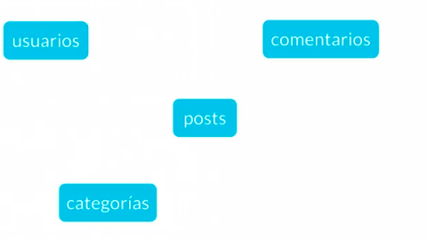

# Fundamentos-bases-datos

### Indice
- [Fundamentos de Bases de Datos](#fundamentos-de-bases-de-datos)
    - [conceptos básicos](#conceptos-basicos)
        - [Tipos de bases de datos](#tipos-de-bases-de-datos)
        - [Servicios](#servicios)
  - [Introducción a las bases de datos relacionales](#introducción-a-las-bases-de-datos-relacionales)
    - [Entidades y atributos](#entidades-y-atributos)
      - [Atributos](#atributos)
      - [Entidades](#entidades)
      - [Entidades del Blog](#entidades-del-blog)
    - [Relaciones](#relaciones)
      - [Cardinalidad: 1 a 1](#cardinalidad-1-a-1)
      - [Cardinalidad: 0 a 1](#cardinalidad-0-a-1)
      - [Cardinalidad: 1 a N (1 a muchos)](#cardinalidad-1-a-n-1-a-muchos)
      - [Cardinalidad: 0 a N](#cardinalidad-0-a-n)
    - [ Multiples muchos](#clase-7-multiples-muchos)
    - [Diagrama ER](#clase-8-diagrama-er)
    - [ Diagrama Físico: tipos de datos y constraints](#clase-9-diagrama-físico-tipos-de-datos-y-constraints)
      - [Tipos de dato](#tipos-de-dato)
      - [Constraints (Restricciones)](#constraints-restricciones)
    - [Diagrama Físico: normalizacion](#clase-10-diagrama-físico-normalizacion)
    - [ Diagrama Físico: normalizando Platziblog](#clase-11-diagrama-físico-normalizando-platziblog)
      - [Diagram Entidad Relacion](#diagram-entidad-relacion)
      - [Diagrama fisico Paso 1](#diagrama-fisico-paso-1)
      - [Diagrama fisico Paso 2](#diagrama-fisico-paso-2)
      - [Diagrama fisico Paso 3](#diagrama-fisico-paso-3)
    - [ Formas normales en DB relacionales](#clase-12-formas-normales-en-db-relacionales)
      - [Primera Forma Normal (1FN)](#primera-forma-normal-1fn)
      - [Segunda Forma Normal (2FN)](#segunda-forma-normal-2fn)
      - [Tercera Forma Normal (3FN)](#tercera-forma-normal-3fn)
      - [Cuarta Forma Normal (4FN)](#cuarta-forma-normal-4fn)
  - [Modulo 3 RDBMS (MySQL) o cómo hacer lo anterior de manera práctica](#modulo-3-rdbms-mysql-o-cómo-hacer-lo-anterior-de-manera-práctica)
    - [ RDB Qué](#clase-13-rdb-qué)
    - [ Instalación local de un RDBMS (Windows)](#clase-14-instalación-local-de-un-rdbms-windows)
    - [Clientes Graficos](#clase-17-clientes-graficos)
    - [Servicios administrados](#clase-18-servicios-administrados)
  - [Modulo 4 SQL hasta en la sopa](#modulo-4-sql-hasta-en-la-sopa)
    - [ Historia de SQL](#clase-19-historia-de-sql)
    - [ DDL create](#clase-20-ddl-create)
    - [ CREATE VIEW y DDL ALTER](#clase-21-create-view-y-ddl-alter)
      - [Create view](#create-view)
      - [Alter Table](#alter-table)
      - [Drop Column Borrando una columna](#drop-column-borrando-una-columna)
    - [ DDL drop](#clase-22-ddl-drop)
    - [ DML](#clase-23-dml)
      - [Insert](#insert)
      - [Update](#update)
      - [Delete](#delete)
      - [Select](#select)
    - [ Que tan standard es SQL](#clase-24-que-tan-standard-es-sql)
    - [Creando Platziblog: tablas independientes](#clase-25-creando-platziblog-tablas-independientes)
    - [Creando Platziblog: tablas transitivas](#clase-26-creando-platziblog-tablas-transitivas)
    - [ Creando Platziblog: tablas transitivas](#clase-27-creando-platziblog-tablas-transitivas)
      - [Reverse Engineer](#reverse-engineer)
    - [ Por qué las consultas son tan importantes](#clase-28-por-qué-las-consultas-son-tan-importantes)
    - [ Estructura básica de un Query](#clase-29-estructura-básica-de-un-query)
      - [Primer Consulta](#primer-consulta)
    - [ SELECT](#clase-30-select)
    - [ FROM](#clase-31-from)
    - [ Utilizando la sentencia FROM](#clase-32-utilizando-la-sentencia-from)
    - [ WHERE](#clase-33-where)
    - [ Utilizando la sentencia WHERE nulo y no nulo](#clase-34-utilizando-la-sentencia-where-nulo-y-no-nulo)
    - [ GROUP BY](#clase-35-group-by)
    - [ORDER BY y HAVING](#clase-36-order-by-y-having)
    - [ El interminable agujero de conejo (Nested queries)](#clase-37-el-interminable-agujero-de-conejo-nested-queries)
    - [ Como convertir una pregunta en un query SQL](#clase-38-como-convertir-una-pregunta-en-un-query-sql)
      - [De pregunta a Query](#de-pregunta-a-query)
    - [ Preguntandole a la base de datos](#clase-39-preguntandole-a-la-base-de-datos)
    - [ Consultando PlatziBlog](#clase-40-consultando-platziblog)
  - [Modulo 4 Introduccion a la bases de datos NO relacionales](#modulo-4-introduccion-a-la-bases-de-datos-no-relacionales)
    - [ Que son y cuales son los tipos de bases de datos no relacionales](#clase-41-que-son-y-cuales-son-los-tipos-de-bases-de-datos-no-relacionales)
      - [Tipos de bases de datos no relacionales:](#tipos-de-bases-de-datos-no-relacionales)
    - [ Servicios administrados y jerarquía de datos](#clase-42-servicios-administrados-y-jerarquía-de-datos)
  - [Modulo 5 Manejo de modelos de datos en bases de datos no relacionales](#modulo-5-manejo-de-modelos-de-datos-en-bases-de-datos-no-relacionales)
    - [ Top level collection con Firebase](#clase-43-top-level-collection-con-firebase)
    - [Creando y borrando documentos en Firestore](#clase-44-creando-y-borrando-documentos-en-firestore)
    - [ Colecciones vs subcolecciones](#clase-45-colecciones-vs-subcolecciones)
    - [ Recreando Platziblog](#clase-46-recreando-platziblog)
    - [ Construyendo Platziblog en Firestore](#clase-47-construyendo-platziblog-en-firestore)
    - [ Proyecto final: transformando tu proyecto en una db no relacional](#clase-48-proyecto-final-transformando-tu-proyecto-en-una-db-no-relacional)
      - [Regla 1. Piensa en la vista de tu aplicación](#regla-1-piensa-en-la-vista-de-tu-aplicación)
  - [Modulo 6 Bases de datos en la vida real](#modulo-6-bases-de-datos-en-la-vida-real)
    - [Bases de datos en la vida real](#clase-49-bases-de-datos-en-la-vida-real)
    - [ Big Data](#clase-50-big-data)
    - [ Data warehouse](#clase-51-data-warehouse)
    - [ Data mining](#clase-52-data-mining)
    - [ ETL](#clase-53-etl)
    - [ Business intelligence](#clase-54-business-intelligence)
    - [ Machine Learning](#clase-55-machine-learning)
    - [ Data Science](#clase-56-data-science)
    - [ Por que aprender bases de datos hoy](#clase-57-por-que-aprender-bases-de-datos-hoy)
  - [Bonus](#bonus)
    - [Bases de datos relacionales vs no relacionales](#clase-58-bases-de-datos-relacionales-vs-no-relacionales)

# Bases de datos relacionales

<p align="left">
  <a href="https://www.microsoft.com/es-es/sql-server/sql-server-downloads" target="_blank">
    
  </a>
  <a href="https://www.postgresql.org/" target="_blank">
    
  </a>
  <a href="https://www.oracle.com/co/index.html" target="_blank">
    
  </a>
  <a href="https://www.mysql.com/" target="_blank">
    
  </a>
</p>

### Tipos de bases de datos

#### Relacionales: 
Una base de datos relacional es una recopilación de elementos de datos con relaciones predefinidas entre ellos. Estos elementos se organizan como un conjunto de tablas con columnas y filas. Las tablas se utilizan para guardar información sobre los objetos que se van a representar en la base de datos. Cada columna de una tabla guarda un determinado tipo de datos y un campo almacena el valor real de un atributo. Las filas de la tabla representan una recopilación de valores relacionados de un objeto o una entidad. Cada fila de una tabla podría marcarse con un identificador único denominado clave principal, mientras que filas de varias tablas pueden relacionarse con claves extranjeras. Se puede obtener acceso a estos datos de muchas formas distintas sin reorganizar las propias tablas de la base de datos.

#### No relacionales: 
Las bases de datos no relacionales son un sistema de almacenamiento de información que se caracteriza por no usar el lenguaje SQL para las consultas. Esto no significa que no puedan usar el lenguaje SQL, pero no lo hacen como herramienta de consulta, sino como apoyo. Por ello también se les suele llamar NoSQL o «no solo SQL».

### Servicios

**Auto administrados:** Es la base de datos que instalas tú y te encargas de actualizaciones, mantenimiento, etc.
**Administrados:** Servicios que ofrecen las nubes modernas como Azure y no debes preocuparte por mantenimiento o actualizaciones.

### Entidad

Una **entidad**  representa algo en el mundo real, incluso algo abstracto. Tienen atributos que son las cosas que los hacen ser una entidad, se diagraman dentro de cuadrados  y **por convención se ponen en plural**.

Nota: Por convección las entidades se ponen en plural por ejemplo laptos

### Atributos

Las entidades tienen atributos que son las cosas que lo hacen ser una entidad.

Los **atributos compuestos** son aquellos que tienen atributos ellos mismos.

Los **atributos llave** son aquellos que identifican a la entidad y no pueden ser repetidos, se diagraman con underline. Existen:

- Naturales: Son inherentes al objeto como el número de serie
- Clave artificial: No es inherente al objeto y se asigna de manera arbitraria

### Ejemplo con laptos


#### Tipos de Entidades

**Entidad Fuerte:** No depende de ninguna entidad para existir

**Entidades débiles:** No pueden existir sin una entidad fuerte y se representan con un cuadrado con doble línea.
**Identidades débiles por identidad:** no se diferencian entre sí más que por la clave de su identidad fuerte.
**Identidades débiles por existencia:** se les asigna una clave propia.


#### Entidad debil: por entidad


#### Entidad debil: por existencia


#### Entidades y atributos del Blog



#### Relaciones
Las relaciones nos permiten ligar o unir nuestras diferentes entidades y se representan con rombos. Por convención se definen
a través de verbos.
Las relaciones tienen una propiedad llamada cardinalidad y tiene que ver con números. Cuántos de un lado pertenecen a cuántos del otro lado:

- Cardinalidad: 1 a 1
- Cardinalidad: 0 a 1
- Cardinalidad: 1 a N
- Cardinalidad: 0 a N


### Cardinalidad: 1 a 1
una persona tiene unos datos de contactos y  una serie de datos de contacto solo pueden 
pertenecer a una sola persona


### Cardinalidad: 0 a 1
la session actual tiene que tener un usuario, pero un usuario puede no estar en 
sesion en este momento


### Cardinalidad: 1 a N
una persona puede tener muchos automoviles, pero un automovil solo puede 
pertenecer a una persona


### Cardinalidad: 0 a N
un paciente siempre esta asignado a una habitación de hospital pero una habitación de
hospital puede estar vacia o no


#### Multiples muchos

un alumno puede estar inscripto en una o varias clases, una clase puede contener varios alumnos


#### Diagrama ER

Un diagrama es como un mapa y nos ayuda a entender cuáles son las entidades con las que vamos a trabajar, cuáles son sus relaciones y qué papel van a jugar en las aplicaciones de la base de datos


### Diagrama Físico: tipos de datos y constraints

### Tipos de dato:

- Texto: CHAR(n), VARCHAR(n), TEXT
- Números: INTEGER, BIGINT, SMALLINT, DECIMAL(n,s), NUMERIC(n,s)
- Fecha/hora: DATE, TIME, DATETIME, TIMESTAMP
- Lógicos: BOOLEAN

### Constraints (Restricciones)

- NOT NULL: Se asegura que la columna no tenga valores nulos
- UNIQUE: Se asegura que cada valor en la columna no se repita
- PRIMARY KEY: Es una combinación de NOT NULL y UNIQUE
- FOREIGN KEY: Identifica de manera única una tupla en otra tabla
- CHECK: Se asegura que el valor en la columna cumpla una condición dada
- DEFAULT: Coloca un valor por defecto cuando no hay un valor especificado
- INDEX: Se crea por columna para permitir búsquedas más rápidas

### Diagrama Físico: normalizacion

La normalización como su nombre lo indica nos ayuda a dejar todo de una forma normal. Esto obedece a las 12 reglas de Codd y nos permiten separar componentes en la base de datos:

- Primera forma normal (1FN): Atributos atómicos (Sin campos repetidos)


- Segunda forma normal (2FN): Cumple 1FN y cada campo de la tabla debe depender de una clave única.


- Tercera forma normal (3FN): Cumple 1FN y 2FN y los campos que NO son clave, NO deben tener dependencias.


- Cuarta forma normal (4FN): Cumple 1FN, 2FN, 3FN y los campos multivaluados se identifican por una clave única.


### Formas normales en Bases de Datos relacionales

La normalización en las bases de datos relacionales es uno de esos temas que, por un lado es sumamente importante y por el otro suena algo esotérico. Vamos a tratar de entender las formas normales (FN) de una manera simple para que puedas aplicarlas en tus proyectos profesionales.

*** Primera Forma Normal (1FN)**
Esta FN nos ayuda a eliminar los valores repetidos y no atómicos dentro de una base de datos.

Formalmente, una tabla está en primera forma normal si:

- *** Todos los atributos son atómicos.** Un atributo es atómico si los elementos del dominio son simples e indivisibles.
- No debe existir variación en el número de columnas.
- Los campos no clave deben identificarse por la clave (dependencia funcional).
- Debe existir una independencia del orden tanto de las filas como de las columnas; es decir, si los datos cambian de orden no deben cambiar sus significados.
Se traduce básicamente a que si tenemos campos compuestos como por ejemplo “nombre_completo” que en realidad contiene varios datos distintos, en este caso podría ser “nombre”, “apellido_paterno”, “apellido_materno”, etc.

- También debemos asegurarnos que las columnas son las mismas para todos los registros, que no haya registros con columnas de más o de menos.

- Todos los campos que no se consideran clave deben depender de manera única por el o los campos que si son clave.

- Los campos deben ser tales que si reordenamos los registros o reordenamos las columnas, cada dato no pierda el significado.

*** Segunda Forma Normal (2FN)***
Esta FN nos ayuda a diferenciar los datos en diversas entidades.

Formalmente, una tabla está en segunda forma normal si:

- Está en 1FN
- Sí los atributos que no forman parte de ninguna clave dependen de forma completa de la clave principal. Es decir, que no existen dependencias parciales.
- Todos los atributos que no son clave principal deben depender únicamente de la clave principal.

Lo anterior quiere decir que sí tenemos datos que pertenecen a diversas entidades, cada entidad debe tener un campo clave separado. Por ejemplo:


En la tabla anterior tenemos por lo menos dos entidades que debemos separar para que cada uno dependa de manera única de su campo llave o ID. En este caso las entidades son alumnos por un lado y materias por el otro. En el ejemplo anterior, quedaría de la siguiente manera:


*** Tercera Forma Normal (3FN) ***

Esta FN nos ayuda a separar conceptualmente las entidades que no son dependientes.

Formalmente, una tabla está en tercera forma normal si:

- Se encuentra en 2FN
- No existe ninguna dependencia funcional transitiva en los atributos que no son clave

Esta FN se traduce en que aquellos datos que no pertenecen a la entidad deben tener una independencia de las demás y debe tener un campo clave propio. Continuando con el ejemplo anterior, al aplicar la 3FN separamos la tabla alumnos ya que contiene datos de los cursos en ella quedando de la siguiente manera.


*** Cuarta Forma Normal (4FN)**
Esta FN nos trata de atomizar los datos multivaluados de manera que no tengamos datos repetidos entre rows.

Formalmente, una tabla está en cuarta forma normal si:

- Se encuentra en 3FN
- Los campos multivaluados se identifican por una clave única

Esta FN trata de eliminar registros duplicados en una entidad, es decir que cada registro tenga un contenido único y de necesitar repetir la data en los resultados se realiza a través de claves foráneas.

Aplicado al ejemplo anterior la tabla materia se independiza y se relaciona con el alumno a través de una tabla transitiva o pivote, de tal manera que si cambiamos el nombre de la materia solamente hay que cambiarla una vez y se propagara a cualquier referencia que haya de ella.


De esta manera, aunque parezca que la información se multiplicó, en realidad la descompusimos o normalizamos de manera que a un sistema le sea fácil de reconocer y mantener la consistencia de los datos.

Algunos autores precisan una 5FN que hace referencia a que después de realizar esta normalización a través de uniones (JOIN) permita regresar a la data original de la cual partió.

### Diagrama Físico: normalizando Platziblog


### ¿Qué es RDB y RDBMS?

RDB (relational database)

RDBMS (Relational DataBase Magement System) Sistema Manejador de Bases de datos relacionales.

La diferencia entre ambos es que las BBDD son un conjunto de datos pertenecientes ( o al menos en teoría) a un mismo tipo de contexto, que guarda los datos de forma persistente para un posterior uso, y el Sistema de gestión de BBDD o sistema manejador, es el que nos permite acceder a ella, es un software, herramienta que sirve de conexión entre las BBDD y el usuario (nos presenta una interfaz para poder gestionarla, manejarla).

RDBMS

MySQL
PostgreSQL
Etc
Todas toman un lenguaje base, pero cada uno lo apropia, imponiéndole diferentes reglas y características.

Aporte creado por Jose Alejandro Rivillas

### Instalación local de un RDBMS (Windows)

Hay dos maneras de acceder a manejadores de bases de datos:

- Instalar en máquina local un administrador de bases relacional.
- Tener ambientes de desarrollo especiales o servicios cloud.

Root es el usuario principal que tendrá todos los permisos y por lo tanto en ambientes de producción hay que tener mucho cuidado al configurarlo.

link 
 <https://dev.mysql.com/downloads/windows/installer/5.6.html>

### Clientes gráficos

Forma gráfica de representar y ver como funciona nuestra base de datos.

### Servicios administrados

Hoy en día muchas empresas ya no tienen instalados en sus servidores los RDBMS sino que los contratan a otras personas. Estos servicios administrados cloud te permiten concentrarte en la base de datos y no en su administración y actualización. 


### Historia de SQL

SQL significa (Structured Query Language) y tiene una estructura clara y fija. Su objetivo es hacer un solo lenguaje para consultar cualquier manejador de bases de datos volviéndose un gran estándar.

Ahora existe el NOSQL o Not Only Structured Query Language que significa que no sólo se utiliza SQL en las bases de datos no relacionales.

### DDL create

SQL tiene dos grandes sublenguajes:
DDL o Data Definition Language que nos ayuda a crear la estructura de una base de datos. Existen 3 grandes comandos:

- Create: Nos ayuda a crear bases de datos, tablas, vistas, índices, etc.
- Alter: Ayuda a alterar o modificar entidades.
- Drop: Nos ayuda a borrar. Hay que tener cuidado al utilizarlo.

 3 objetos que manipularemos con el lenguaje DDL:

- Database o bases de datos 
- Table o tablas. Son la traducción a SQL de las entidades
- View o vistas: Se ofrece la proyección de los datos de la base de datos de forma entendible.

### DDL drop

Básicamente borra o desaparece de nuestra base de datos algún elemento. 
> DROP TABLE people 

### DML

DML trata del contenido de la base de datos. Son las siglas de Data Manipulation Language y sus comandos son:

- Insert: Inserta o agrega nuevos registros a la tabla.
- Update: Actualiza o modifica los datos que ya existen.
- Delete: Esta sentencia es riesgosa porque puede borrar el contenido de una tabla.
- Select: Trae información de la base de datos.

### ¿Qué tan standard es SQL?

La utilidad más grande de SQL fue unificar la forma en la que pensamos y hacemos preguntas a un repositorio de datos. Ahora que nacen nuevas bases de datos igualmente siguen tomando elementos de SQL.

### Tablas independientes del blog

- Una buena práctica es comenzar creando las entidades que no tienen una llave foránea.
- Generalmente en los nombres de bases de datos se evita usar eñes o acentos para evitar problemas en los manejadores de las bases de datos.

```sql
CREATE TABLE categorias(
    id int not null auto_increment,
    categoria varchar(30) not null,
    PRIMARY KEY (id)
)

CREATE TABLE etiquetas(
    id int not null auto_increment,
    nombre_etiqueta varchar(30) not null,
    PRIMARY KEY (id)
)

CREATE TABLE usuarios(
    id int not null auto_increment,
    login varchar(30) not null,
    password varchar(32) not null,
    nickname varchar(40) not null,
    email varchar(40) not null,
    PRIMARY KEY (id),
    UNIQUE INDEX email_UNIQUE (email asc)
)

```

# Tablas dependientes del Blog

El comando “cascade” sirve para que cada que se haga un update en la tabla principal, se refleje también en la tabla en la que estamos creando la relación.

```sql

CREATE TABLE posts(
    id int not null auto_increment,
    titulo varchar(150) not null,
    fecha_publicacion Timestamp null,
    contenido Text not null,
    status Char(8) null default 'activo',
    usuario_id int not null,
    categoria_id int not null,
    PRIMARY KEY (id)
);

ALTER TABLE posts
ADD INDEX posts_usuarios_idx (usuario_id asc);

ALTER TABLE posts
ADD Constraint posts_usuarios
    FOREIGN KEY (usuario_id)
    REFERENCES usuarios (id)
    ON DELETE NO ACTION
    ON UPDATE CASCADE;

ALTER TABLE posts
ADD INDEX posts_categorias_idx (categoria_id asc);

ALTER TABLE posts
ADD Constraint posts_categorias
    FOREIGN KEY (categoria_id)
    REFERENCES categorias (id)
    ON DELETE NO ACTION
    ON UPDATE CASCADE;

```
# Tablas transitivas del Blog

- Las tablas transitivas sirven como puente para unir dos tablas. No tienen contenido semántico.
- Reverse Engineer nos reproduce el esquema del cual nos basamos para crear nuestras tablas. Es útil cuando llegas a un nuevo trabajo y quieres entender cuál fue la mentalidad que tuvieron al momento de crear las bases de datos.

```sql
CREATE TABLE comentarios(
    id int not null auto_increment,
    comentario Text not null,
    usuario_id int not null,
    post_id int not null,
    PRIMARY KEY (id)
);

ALTER TABLE comentarios
ADD INDEX comentarios_usuarios_idx (usuario_id asc);

ALTER TABLE comentarios
ADD Constraint comentarios_usuario
    FOREIGN KEY (usuario_id)
    REFERENCES usuarios (id)
    ON DELETE NO ACTION
    ON UPDATE NO ACTION;

ALTER TABLE comentarios
ADD INDEX comentarios_post_idx (post_id asc);

ALTER TABLE comentarios
ADD Constraint comentarios_posts
    FOREIGN KEY (post_id)
    REFERENCES posts (id)
    ON DELETE NO ACTION
    ON UPDATE CASCADE;

CREATE TABLE posts_etiquetas(
    id int not null auto_increment,
    post_id int not null,
    etiqueta_id int not null,
    PRIMARY KEY (id)
);

ALTER TABLE posts_etiquetas
ADD INDEX postsetiquetas_post_idx (post_id asc);

ALTER TABLE posts_etiquetas
ADD Constraint postsetiquetas_posts
    FOREIGN KEY (post_id)
    REFERENCES posts (id)
    ON DELETE NO ACTION
    ON UPDATE NO ACTION;

ALTER TABLE posts_etiquetas
ADD INDEX postsetiquetas_etiquetas_idx (post_id asc);

ALTER TABLE posts_etiquetas
ADD Constraint postsetiquetas_etiquetas
    FOREIGN KEY (etiqueta_id)
    REFERENCES etiquetas (id)
    ON DELETE NO ACTION
    ON UPDATE NO ACTION;

```

# Modelo logico


#### ¿Por qué las consultas son tan importantes?

Las consultas o queries a una base de datos son una parte fundamental ya que esto podría salvar un negocio o empresa.
Alrededor de las consultas a las bases de datos se han creado varias especialidades como ETL o transformación de datos, business intelligence e incluso machine learning.

### Estructura básica de un Query

Los queries son la forma en la que estructuramos las preguntas que se harán a la base de datos. Transforma preguntas en sintaxis.

El query tiene básicamente 2 partes: SELECT y FROM y puede aparecer una tercera como WHERE.

- La estrellita o asterisco (*) quiere decir que vamos a seleccionar todo sin filtrar campos.

```sql
select city, count(*) as total
from people
where active = true
group by city
order by total desc
having total >=2
```

### SELECT
SELECT se encarga de proyectar o mostrar datos.

- El nombre de las columnas o campos que estamos consultando puede ser cambiado utilizando AS después del nombre del campo y poniendo el nuevo que queremos tener:

```sql
SELECT titulo AS encabezado
FROM posts;
```

- Existe una función de SELECT para poder contar la cantidad de registros. Esa información (un número) será el resultado del query:

```sql
SELECT COUNT(*)
FROM posts;
```

### FROM

FROM indica de dónde se deben traer los datos y puede ayudar a hacer sentencias y filtros complejos cuando se quieren unir tablas. La sentencia compañera que nos ayuda con este proceso es JOIN.

Los diagramas de Venn son círculos que se tocan en algún punto para ver dónde está la intersección de conjuntos. Ayudan mucho para poder formular la sentencia JOIN de la manera adecuada dependiendo del query que se quiere hacer.

